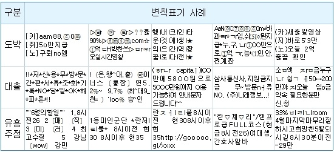
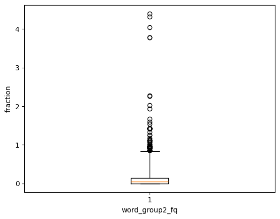
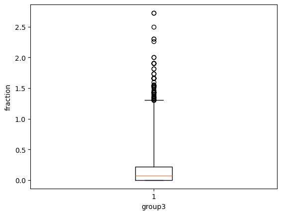
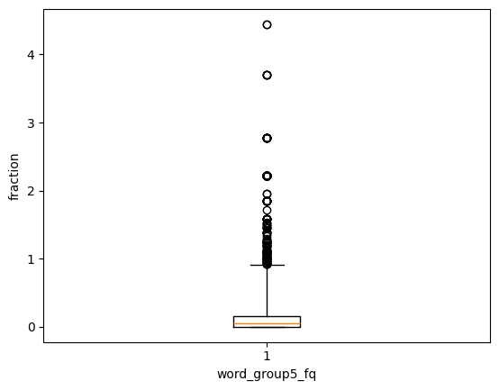

**📅개발 기간: 2025.03.31 ~ 2025.04.01**
# 🎓 대학교 수강 이탈 예측 모델링

## 🏃‍♂️ 팀원 소개
- **SK 네트웍스 Family AI 캠프 11기**

- **팀명:** **6조**
---

|[@백미송](https://github.com/misong-hub)|[@김성지](https://github.com/kimseoungji0801)|[@이채은](https://github.com/chaeeunlee05)|[@이혜성](https://github.com/comet39)|[@홍성욱](https://github.com/Sung-WookHong)|
|------|------|------|------|------|
|  |  |  |  |  |

 

## 목차   
1. 프로젝트 개요   
    1) 프로젝트 목표   
    3) 데이터 세트 확인   
2. 탐색적 데이터 분석 (EDA)   
    1)    
3. 학생 이탈 예측 모델 학습   
    1)   
4. 학생 정보 기반 맞춤형 교육과정 설계
5. Appendix
   
 

---

## 1. 🔍 프로젝트 개요
### 1) 📌 프로젝트 목표
 * Open University의 실제 데이터셋을 활용하여 수강 철회 결정에 영향을 미치는 주요 요인 분석
 * 수업 난이도, 학생의 기본 정보, 과제 제출 패턴 등을 종합적으로 분석해 수강 철회 확률 예측
 * 신규 수강생의 데이터를 기반으로 수강 철회 가능성을 조기에 예측하고, 맞춤형 교육과정 설계방안 제시

### 2) 📂 데이터셋    
 * 데이터 개요   
   영국 Open University에서 공개한 대표적인 공개 데이터: [Open University Learning Analytics Dataset (OULAD)](https://analyse.kmi.open.ac.uk/#open-dataset)
 * 데이터 구성
    1. `assessments.csv` : 각 강의에서 제공되는 과제 및 평가 관련 세부 정보  
    2. `courses.csv`: 개설된 각 강의의 식별자, 강의명 등 강의 기본 정보  
    3. `studentAssessment.csv`: 학생들의 과제 제출 이력과 성적 데이터를 포함한 학습 성과 정보  
    4. `studentInfo.csv` : 각 학생의 인구통계학적 특성(성별, 연령, 최종 학력 등)  
    5. `studentRegistration.csv`: 학생들의 수강 신청 내역과 각 강의에 대한 철회 여부  
 * 5개의 csv 파일을 `학생 ID(id_student)`, `과목 코드(code_module)`, `학기(code_presentation)`를 기준으로 병합
 * 최종 병합된 데이터에 포함된 컬럼  [불필요한 컬럼 제거](#불필요한-컬럼-제거)

| 컬럼명                     | 설명                                                                 |
|----------------------------|----------------------------------------------------------------------|
| gender                     | 학생의 성별 (남성, 여성)                                         |
| highest_education          | 학생이 달성한 최고 교육 수준 (고등학교, 학사, 석사)           |
| imd_band                   | 학생이 속한 지역의 사회경제적 지위 (IMD) |
| age_band                   | 학생의 연령대 (예: '0-35', '35-55' 등)                                 |
| num_of_prev_attempts       | 해당 과목을 이전에 시도한 횟수                                       |
| studied_credits            | 학생이 현재까지 이수한 학점 수                                       |
| disability                 | 장애 여부                                   |
| final_result               | 최종 결과 (Pass, Fail, Withdrawn)                            |
| date_registration          | 학생이 등록한 날짜                                                  |
| module_presentation_length | 모듈(course)의 전체 길이                        |
| my_average_score           | 학생의 평균 점수                                                    |
| my_score_std               | 학생 점수의 표준편차                                                |
| my_score_trend             | 학생 점수의 추세 (점수가 상승/하락하는 경향)                         |
| assessment_weight          | 평가 항목의 가중치                                                  |
| weighted_score             | 가중치를 적용한 점수                                                |
| course_avg_score           | 해당 과목 전체 평균 점수                                            |
| course_max_score           | 해당 과목에서 얻을 수 있는 최대 점수                                |
| course_std_score           | 해당 과목 점수의 표준편차                                           |
| course_late_rate           | 해당 과목에서 학생들의 늦은 제출 비율                               |
| days_early_submission      | 학생이 과제를 얼마나 일찍 제출했는지                  |
| my_late_rate               | 학생 개인의 늦은 제출 비율                                          |

| 컬럼명                     | 설명                                                                 |
|----------------------------|----------------------------------------------------------------------|
| gender                     | 학생의 성별 (남성, 여성)                                         |
| highest_education          | 학생이 달성한 최고 교육 수준 (고등학교, 학사, 석사)           |
| imd_band                   | 학생이 속한 지역의 사회경제적 지위 (IMD) |
| age_band                   | 학생의 연령대 (예: '0-35', '35-55' 등)                                 |
| num_of_prev_attempts       | 해당 과목을 이전에 시도한 횟수                                       |
| studied_credits            | 학생이 현재까지 이수한 학점 수                                       |
| disability                 | 장애 여부                                   |
| final_result               | 최종 결과 (Pass, Fail, Withdrawn)                            |
| date_registration          | 학생이 등록한 날짜                                                  |
| module_presentation_length | 모듈(course)의 전체 길이                        |
| my_average_score           | 학생의 평균 점수                                                    |
| my_score_std               | 학생 점수의 표준편차                                                |
| my_score_trend             | 학생 점수의 추세 (점수가 상승/하락하는 경향)                         |
| assessment_weight          | 평가 항목의 가중치                                                  |
| weighted_score             | 가중치를 적용한 점수                                                |
| course_avg_score           | 해당 과목 전체 평균 점수                                            |
| course_max_score           | 해당 과목에서 얻을 수 있는 최대 점수                                |
| course_std_score           | 해당 과목 점수의 표준편차                                           |
| course_late_rate           | 해당 과목에서 학생들의 늦은 제출 비율                               |
| days_early_submission      | 학생이 과제를 얼마나 일찍 제출했는지                  |
| my_late_rate               | 학생 개인의 늦은 제출 비율                                          |

## 5. Appendix

#### 불필요한 컬럼 제거

  

  그림 1.1 언어 데이터가 가지는 단어간 상호관계 예시

 

---
## 2. 📜 데이터 확인
데이터 출처: https://archive.ics.uci.edu/dataset/94/spambase

### 1) 🚫 스팸 데이터 특성 파악
 * 특정 단어의 빈도높은 반복 (예: 주식 등)

  

  그림 2.1 초기 스팸 데이터 형식

 
 
 

* 단어 인식 혼동을 유발하는 비문 사용 (예: ㅈrㅁ금, ㅎrㄴr 등)
* 과도한 특수문자 사용 (예: *, [] 등)
  

  

  그림 2.2 광고 유형별 변칙 표기 사례

 

### 2) 💡 데이터 도큐맨테이션
**① 총 4601개의 서로 다른 스팸 메일 분석 데이터 (행: 4601개)**

**② 총 58개의 서로 다른 데이터 속성 (열: 58개)**  
&nbsp;&nbsp;&nbsp;**i. 단어 빈도 (word frequency) 속성 (48개)**  
&nbsp;&nbsp;&nbsp;&nbsp;&nbsp;-  특정 단어가 이메일에서 차지하는 비율 (0~1 사이의 float 타입)  
  
&nbsp;&nbsp;&nbsp;**ii. 문자 빈도 (character frequency) 속성 (6개)**  
&nbsp;&nbsp;&nbsp;&nbsp;&nbsp;-  특정 특수문자가 이메일에서 차지하는 비율 (0~1 사이의 float 타입)  
  
&nbsp;&nbsp;&nbsp;**iii. 대문자 연속 속성 (3개)**  
&nbsp;&nbsp;&nbsp;&nbsp;&nbsp;-  연속된 대문자 시퀀스의 평균 길이 (1 이상의 float 타입)  
&nbsp;&nbsp;&nbsp;&nbsp;&nbsp;-  가장 긴 연속된 대문자 시퀀스 길이 (1 이상의 int 타입)  
&nbsp;&nbsp;&nbsp;&nbsp;&nbsp;-  이메일 내 대문자 개수의 총합 (1 이상의 int 타입)  
  
&nbsp;&nbsp;&nbsp;**iv. 클래스 속성 (1개)**  
&nbsp;&nbsp;&nbsp;&nbsp;&nbsp;-  이메일의 스팸 여부를 나타내는 속성 (0, 1)  
&nbsp;&nbsp;&nbsp;&nbsp;&nbsp;-  0: 일반 이메일  
&nbsp;&nbsp;&nbsp;&nbsp;&nbsp;-  1: 스팸 이메일  

  

  그림 2.3 스팸메일 구별 데이터프레임 개요

 

### 3) ⁉️ 데이터의 주요 문제

 * 데이터 내 결측치 존재  
 * 과도한 데이터 속성 개수  
 * 0인 값이 과다하게 포함된 데이터 분포  
 * 데이터 속성 간 스케일 불균형  

---
## 3. 💻 탐색적 데이터 분석 (EDA) 수행

### 1) 🫥 결측치 탐색  

* 각 데이터 속성의 결측치 확인 (결측치가 없을 경우 4601 non-null)

  

  그림 3.1 데이터 결측치 확인을 위한 Pandas의 <code>DataFrame.info()</code> 활용

 

* 결측치는 단어가 존재하지 않았을 가능성이 높아 값을 0으로 대체

  

  그림 3.2 결측치가 제거된 데이터프레임

 

### 2) 👨‍👩‍👧‍👦 데이터 군집화

* 스팸 구별을 위한 데이터 속성이 과다함
* 같은 메일에서 자주 함께 사용되는 단어들을 군집화하여 데이터 속성 축소

  

  그림 3.3 단어 빈도 속성들 간의 피어슨 상관 계수 heatmap 시각화 이미지

 

  

  그림 3.4 피어슨 상관 계수가 높은 단어 그룹 예시

 
  
* 단어 빈도 속성: K-means 클러스터링*을 활용하여 48개의 속성을 5개의 그룹으로 구분
* 군집화된 단어들을 시각화하기 위해 주성분 분석 (PCA)**으로 데이터 속성을 2개로 축소 후 산점도(scatter) 그래프 작성
  
&nbsp;&nbsp;&nbsp;&nbsp;&nbsp;&nbsp;*K-means 클러스터링: 데이터를 K개의 군집으로 나누어 중심점을 기준으로 반복적으로 최적화  
&nbsp;&nbsp;&nbsp;&nbsp;&nbsp;&nbsp;**주성분 분석 (PCA): 고차원 데이터를 저차원으로 변환하여 주요 정보만 보존

  

  그림 3.5 상관관계가 높은 단어들을 5개의 그룹으로 군집화한 뒤 시각화

 

* 특수문자 빈도 속성: 6개의 속성을 1개의 그룹으로 통합
* 대문자 연속 속성: 각각이 다른 정보를 나타낼 수 있으므로 유지
* 최종적으로 47개의 데이터 속성을 9개로 축소

  

  그림 3.6 단어/특수문자의 빈도 속성 데이터 군집화 후 데이터 프래임 개요

 

### 3) 🥸 데이터 변환 및 피처 엔지니어링

* 단어들의 빈도 속성을 군집화하였음에도 불구하고 속성값이 0인 데이터가 과다
* 값이 0인 데이터가 많을 경우 데이터의 불균형이 심화될 가능성 존재
* 값이 0인 데이터가 30%를 초과할 경우 임계값을 설정하여 데이터 값을 0과 1로 이진화
* 데이터의 임계값은 이상치를 제외한 값들의 평균 사용
  
 
    
* 값이 0인 데이터의 비율이 30%를 초과하는 word_group2, group3, group5의 데이터 분포 확인을 위해 박스(box) 플롯 작성
* 박스 플롯을 통해 group2, group3, group5의 데이터의 불균형이 심함을 확인할 수 있음

  

  

  그림 3.7 word_group2_frq 속성의 박스 플롯

 

  

  

  그림 3.8 word_group3_frq 속성의 박스 플롯

 

  

  

  그림 3.9 word_group5_frq 속성의 박스 플롯

 

  

  그림 3.10 데이터 속성 군집화 후 데이터 프래임 개요

 

### 4) ⚖️ 데이터 스케일링

* 전체적인 데이터 속성들의 스케일을 통일시키기 위해 `StandardScaler()` 수행

  

  그림 3.11 데이터 정규화 후 데이터 프래임 개요

 

---
## 4. 📜 결론

**- 본 프로젝트를 통해 스팸메일 데이터를 탐색적으로 분석(EDA)하고, 효과적인 데이터 전처리 및 피처 엔지니어링을 수행함.**

**- 스팸메일은 특정 단어의 반복적 사용, 비정상적인 문자 조합 등의 특징을 보이며, 이러한 특성을 데이터 분석을 통해 확인함.**

**- 데이터 간 상관관계를 분석하여 연관성이 높은 속성들을 군집화하고, 이를 기반으로 보다 효율적인 데이터프레임을 구축함.**

**- 데이터 불균형 문제를 해결하기 위해 평균값을 활용하여 데이터를 이진화하고, 불균형성을 완화하는 전처리 과정을 적용함.**

**- 데이터의 결측치 제거 및 스케일링을 수행하여 향후 모델 학습 시 데이터의 균형을 유지하도록 조정함.**

**- 본 연구는 대규모 언어모델(LLM) 학습을 위한 기초 단계로서, 언어 데이터에 대한 분석 및 이해도를 증진하는 데 기여할 것으로 기대됨.**

